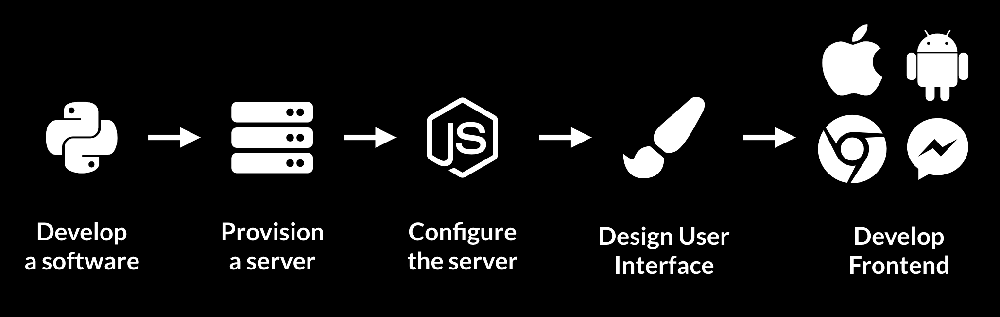

# Interface for Vision Apps

## Comparing today to the future we envision

Have you tried delivering your software invention to actual consumers? If you have, you would know that the overhead takes more of your time than the core invention itself. 

Concretely, imagine that you invented a super resolution model that receives an image and outputs the same image in better quality. Before your first consumer can use your model, you need to design and develop a client application \(i.e. an app on iPhone, Android, or web\), deploy a server to run your model, set up a database, and configure the network connections between each pair of the components. 

We envision a future in which developers can focus on the interesting work and forget about such overhead. Write a function that receives an image and returns the image in better quality, then magically, get a link that opens an app that your consumers can use to immediately start sending images to your function. We envision a future in which developers have more opportunities and consumers have more options.

## What is a vision app?

A vision app receives an image as input, and returns an arbitrary information encoded in HTML as output. The HTLM can include text, image, video, or even custom interactions you design. This simple framework supports powerful use cases like example below.



Receive an image of dining menu. Use OCR to read text. Look up customer reviews and photos from Yelp. Then return the image of dining menu back to user with Yelp rating and photos overlaid over the dining menu. 

We focus on vision apps, because we want to help developers get ready for when AR glasses replace smartphones. We will support more inputs, such as speech, in the near future as well.

## Try it out yourself

Do you have a function that processes images? Try deploying it on Interface and sharing it with your friends and family by following through [Tutorial for Experts](tutorial/tutorial-for-experts.md) \([Tutorial for Beginners](tutorial/tutorial-for-beginners.md) is arriving by End of July with template code\).

